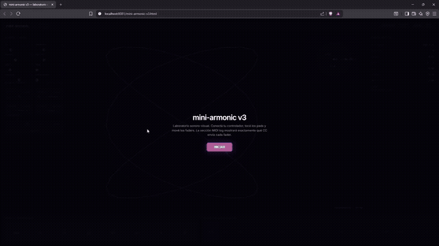

# mini-armonic

Laboratorio sonoro-visual para explorar, programar y transmitir **beacons armónicos**.

Un beacon armónico es una secuencia de relaciones de frecuencia simples —ratios como `1:1`, `2:3`, `3:4`, `φ`— que se recorre en loop como un faro. En lugar de tocar notas aisladas, manipulás proporciones, visualizás su geometría en tiempo real y escuchás cómo resuenan entre sí.

Basado en ideas de **Harmonic Information Theory** por Mariano Fernández Méndez / AlterMundi.

---

## Demo

Abrir en el navegador, conectar el controlador y tocar un pad:



descargar el video original: [mini-armonic-demo.mp4](./mini-armonic-demo.mp4)

---

## Qué es esto

mini-armonic no es un DAW. No hay pistas, clips ni arreglos. Es un **laboratorio de intervalos y proporciones** con tres modos de trabajo:

- **Explorar**: tocá un pad, girá un knob y observá cómo cambia el campo armónico y su figura de Lissajous.
- **Programar**: construí una secuencia de hasta 16 ratios en el programador de pasos.
- **Transmitir**: activá ARP + SEQ y dejá que el beacon recorra la secuencia en loop.

### Elementos principales

- **Campo armónico sostenido** a partir de una frecuencia fundamental `f0`.
- **Superposición de armónicos** con spread configurable.
- **Figura de Lissajous** del ratio activo: la forma geométrica *es* el intervalo.
- **Espectro** coloreado dinámicamente por el ratio.
- **Círculo armónico** con los armónicos `1:n` distribuidos logarítmicamente.
- **Programador de 16 pasos** para secuencias de ratios (beacons).
- **Exportación a WAV** del campo armónico actual, pensada como captura de un estado descubierto.
- **MIDI inspector** integrado para ver todo lo que llega del controlador.

---

## Requisitos

- Navegador moderno con soporte para **Web MIDI** y **Web Audio**: Chrome, Edge, Brave, Opera.
- Un controlador MIDI (Minilab 3, teclado con faders, etc.).
- Python 3 para servir el archivo localmente (Web MIDI requiere `localhost` o HTTPS).

---

## Cómo usarlo

```bash
cd mini-armonic
python3 -m http.server 8081
```

Abrí en el navegador:

```text
http://localhost:8081/mini-armonic.html
```

Hacé clic en **INICIAR**, conectá tu controlador y empezá a explorar.

> No funciona abriendo el archivo `.html` directamente porque Web MIDI está restringido a `localhost` o HTTPS.

---

## Exportar a WAV

En el header hay un selector de duración (**5s / 10s / 30s / 60s**) y un botón **EXPORT WAV**. Al tocarlo, la app renderiza el campo armónico actual (con la configuración de f0, ratios, armónicos y spread vigente) a un archivo WAV estéreo de 16-bit usando `OfflineAudioContext`.

Los renders aparecen en la sección **Takes** del panel derecho, donde podés:

- Renombrarlos.
- Reproducirlos.
- Descargarlos como `.wav`.
- Eliminarlos.

El formato es PCM estándar, compatible con cualquier DAW.

---

## Mapeo MIDI

### Knobs del Minilab 3 (factory preset)

| Knob | CC  | Parámetro     | Rango       |
|------|-----|---------------|-------------|
| 1    | 86  | f0            | 50 - 400 Hz |
| 2    | 87  | armónicos     | 1 - 16      |
| 3    | 89  | spread        | 0.2 - 2.0   |
| 4    | 90  | ratio X       | 1 - 8       |
| 5    | 110 | ratio Y       | 1 - 8       |
| 6    | 111 | fase          | 0 - 2π      |
| 7    | 116 | volumen       | 0 - 1       |
| 8    | 117 | perturbación  | 0 - 1       |

También soporta el preset alternativo Analog Lab/User MIDI con CC 21-28.

### Faders físicos (modo learn)

La interfaz tiene 4 slots para faders físicos:

1. Hacé clic en **LEARN** del slot que querés asignar.
2. Mové el fader físico de tu controlador.
3. El slot captura el CC y queda mapeado.

Por defecto los slots controlan:

| Slot | Parámetro |
|------|-----------|
| 1    | f0        |
| 2    | volumen   |
| 3    | BPM       |
| 4    | ratio Y   |

Si movés un control no asignado, el **MIDI inspector** muestra el CC exacto.

### Pads del Minilab 3 (notas 36-43)

| Pad | Nota | Preset HIT      | Ratio    | Tipo     | Shift + pad        |
|-----|------|-----------------|----------|----------|--------------------|
| 1   | 36   | unísono         | 1:1      | storage  | cargar beacon 1    |
| 2   | 37   | octava          | 1:2      | storage  | cargar beacon 2    |
| 3   | 38   | quinta          | 2:3      | storage  | cargar beacon 3    |
| 4   | 39   | cuarta          | 3:4      | storage  | cargar beacon 4    |
| 5   | 40   | tercera mayor   | 4:5      | storage  | cargar beacon 5    |
| 6   | 41   | sexta menor     | 3:5      | storage  | cargar beacon 6    |
| 7   | 42   | φ query         | 1:φ      | query    | cargar beacon 7    |
| 8   | 43   | φ² query        | 1:φ²     | query    | cargar beacon 8    |

Los primeros seis presets cubren la región densa **1:2:3:4:5** que Mariano Fernández Méndez identifica en el Harmonic Beacon como la que genera las figuras de Lissajous más estables. Los dos últimos son ratios de activación: no buscan estabilidad sino recorrer el campo sin hacer _lock_.

Con **SHIFT** activo, los 8 pads se convierten en lanzadores de los **beacons de usuario** guardados.

### Beacons de usuario

mini-armonic tiene 8 slots para guardar secuencias de ratios (beacons) en `localStorage`.

- **Click** en un slot: carga el beacon en el programador de 16 pasos y lo reproduce.
- **Shift + click** en un slot: guarda la secuencia actual en ese slot.
- **Teclas `1` a `8`**: cargan el beacon correspondiente.
- Los beacons se persisten entre sesiones.

Cada beacon guarda:

- los 16 pasos con sus ratios,
- un nombre (`Beacon 1`, `Beacon 2`, etc.),
- tempo y modo de recorrido (reservado para futuras versiones).

### Funciones

| Botón  | Acción                                        |
|--------|-----------------------------------------------|
| SHIFT  | Activa funciones secundarias de los pads.     |
| ARP    | Arpegiador on/off.                            |
| SEQ    | Secuenciador on/off.                          |
| BEACON | Carga la secuencia inspirada en la portada del libro HIT (resonancia 1:2:3:4:5). |
| SAVE   | Guarda el ratio actual en el paso actual.     |
| CLEAR  | Restaura la secuencia por defecto.            |

### Teclado del controlador

Las notas del teclado (C3-C6 aprox.) cambian la frecuencia fundamental `f0` según la nota tocada.

### Atajos del teclado de la PC

- `Space` — toggle SHIFT.
- `A` — toggle arpegiador.
- `B` — cargar secuencia BEACON.
- `P` — play/pause del secuenciador.
- `↑` / `↓` — subir/bajar BPM de a 5.
- `←` / `→` — modo de recorrido anterior/siguiente.
- `<` / `>` — beacon de usuario anterior/siguiente.
- `1` - `8` — cargar beacon de usuario 1-8.

---

## Interfaz

| Sección              | Descripción                                                      |
|----------------------|------------------------------------------------------------------|
| Faders / Knobs       | Controles virtuales de los 8 parámetros principales.             |
| Faders físicos       | 4 slots con modo learn para faders reales.                       |
| Funciones            | SHIFT, ARP, SEQ, BEACON, SAVE, CLEAR.                            |
| Canvas central       | Lissajous, espectro y círculo armónico.                          |
| Modo focus           | Botón □ para enfocar solo el canvas.                             |
| Campo activo         | Métricas en tiempo real, coloreadas por ratio.                   |
| Takes                | Renders WAV exportados con play/download/delete.                 |
| MIDI inspector       | Log de mensajes MIDI entrantes.                                  |
| Presets armónicos    | 8 pads de proporciones (semillas del beacon).                    |
| Beacons de usuario   | 8 slots para guardar/cargar secuencias de ratios.                |
| Programador 16 pasos | Secuenciador de ratios que define el beacon.                     |

---

## Visualización

La visualización está pensada como un **visor científico-musical** del ratio activo, no como un efecto decorativo.

- **Lissajous**: figura XY sincronizada con el reloj de audio (`audioCtx.currentTime`). Cada vez que cambia el ratio —por un pad, por el secuenciador o por BEACON— la fase se reinicia para que la figura aparezca exacta desde el origen. Incluye:
  - retícula cartesiana sutil con ejes X/Y,
  - círculo unitario de referencia,
  - marcas `-1`, `0`, `1`,
  - trail degradado con glow externo e interno,
  - marcador de fase y línea de lectura al centro,
  - etiqueta del ratio y valores de `f0` y fase.
- **Espectro**: barras frecuenciales compactas en la esquina inferior derecha, con gradiente dinámico y picos armónicos etiquetados `1:n`.
- **Círculo armónico**: armónicos `1:n` distribuidos logarítmicamente alrededor de `f0`, en la esquina superior derecha.
- **Paleta cromática**: cada preset de pad tiene un color asignado que se propaga al acento de la interfaz, sliders, métricas y visualizaciones.

### Colores por preset

| Pad | Ratio | Color      |
|-----|-------|------------|
| 1   | 1:1   | violeta    |
| 2   | 1:2   | cian       |
| 3   | 2:3   | índigo     |
| 4   | 3:4   | menta      |
| 5   | 3:5   | ámbar      |
| 6   | 4:5   | naranja    |
| 7   | φ     | dorado     |
| 8   | φ²    | magenta    |

---

## Programador de 16 pasos

Cada paso guarda un ratio `X:Y`. Cuando **ARP** y **SEQ** están activos, el campo avanza automáticamente por los 16 pasos. Hacé clic en un paso para guardar el ratio actual ahí, o usá **SHIFT + Pad 1**.

El botón **BEACON** carga una secuencia de referencia inspirada en la portada del libro HIT y prende ARP + SEQ automáticamente, así el laboratorio empieza a transmitir de inmediato.

---

## Archivos

| Archivo                | Descripción                                      |
|------------------------|--------------------------------------------------|
| `mini-armonic.html`    | Aplicación principal.                            |
| `screenshot.png`       | Captura de la interfaz actual.                   |
| `README.md`            | Este archivo.                                    |

---

## Stack técnico

- HTML5 + CSS3 (grid, flexbox, glassmorphism).
- Vanilla JavaScript.
- Web Audio API para síntesis.
- Web MIDI API para controladores.
- Canvas 2D para visualización.

Sin dependencias externas. Servidor local solo para cumplir con las restricciones de Web MIDI.

---

## Créditos

- Concepto: [Mariano Fernández Méndez](https://hit.altermundi.net/) / AlterMundi.
- Implementación: JereC4str0 + Hermes Agent.

---

## Roadmap

- [x] Exportar campo armónico a WAV.
- [x] BEACON: secuencia 1:2:3:4:5 con activación automática de ARP + SEQ.
- [x] Colores más neon y fade rápido al cambiar de preset.
- [x] Lissajous sincronizado con el reloj de audio y fase reiniciada por ratio.
- [x] Sistema de beacons de usuario: 8 slots con guardado/carga en `localStorage`.
- [x] BPM controlable con knob del Minilab 3 (vía learn) y tap-tempo.
- [x] Modos de recorrido del beacon: forward, reverse, ping-pong, random, manual.
- [x] Visualización del camino del beacon sobre el canvas.
- [ ] Librería de beacons: ciclo de quintas, serie φ, escala justa, inverso, aleatorio.
- [ ] Editor visual del beacon: constelación conectada editable sobre el canvas.
- [ ] Exportar/importar beacons como JSON.
- [ ] Modo osciloscopio XY a pantalla completa.
